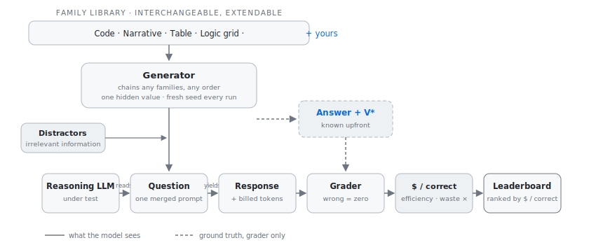

# Token Efficiency Benchmark

[](https://github.com/novigens/token-efficiency-benchmark/actions/workflows/ci.yml)
[](LICENSE)
[](pyproject.toml)

**What does a correct answer actually cost on each LLM?**

That's the question this benchmark answers. Every model provider bills you per token, but what you actually want to buy is correct outcomes. Those two things have drifted far apart, and nobody measures the gap.

Here's the problem in one picture. Ask two models a question whose answer is `38`:

- **Model A** thinks silently and replies: `38`. You pay for ~270 prompt tokens and 1 output token.
- **Model B** writes 1,200 tokens of step-by-step reasoning and then says `38`. You pay for ~270 prompt tokens and 1,200 output tokens.

Both models are "100% accurate," and every accuracy leaderboard scores them identically. But Model B cost you roughly **16× more** for the same outcome. If Model B is a reasoning model, most of those tokens were never even shown to you. Multiply that by a million queries a month, and the difference is a budget line, not a rounding error.

This benchmark makes that difference visible, per model, in dollars.

## Leaderboard

First public run, July 3, 2026: twelve model configurations against the same 20 fresh hybrid-gauntlet tasks (code → narrative → table, at depths 3 and 6), single worker, provider-reported token counts, prices per [`pricing/prices.json`](pricing/prices.json). Every question, raw response, reasoning trace, and knob setting ships in [`benchmark_data/runs/20260703T070656Z_098392/`](benchmark_data/runs/20260703T070656Z_098392/): `manifest.json` records the exact API parameters per row, `VALIDATION.md` the pre-flight probes, and `ANALYSIS.md` the independent audit of these numbers.

| # | model (exact config) | acc | \$/correct | waste | token-eff | out-tok |
|--:|----------------------|----:|-----------:|------:|----------:|--------:|
| 🏆 | **Human** (Ideal, the `echo` fixture: the bare correct answer) | **100%** | **~\$0.0** | **0x** | **100%** | **2** |
| 1 | `openai:gpt-4.1-nano` | 45% | 🥇 \$0.00108 | 11.2x | 8.7% | 1,109 |
| 2 | `openai:gpt-5.4-nano` | 40% | \$0.00184 | 5.4x | 15.8% | 520 |
| 3 | `moonshot:kimi-k2.5#thinking=off` | 100% | \$0.00217 | 6.1x | 14.4% | 637 |
| 4 | `moonshot:kimi-k2.6#thinking=off` | 90% | \$0.00395 | 7.3x | 12.7% | 787 |
| 5 | `anthropic:claude-haiku-4-5` | 80% | \$0.00520 | 7.0x | 12.6% | 734 |
| 6 | `openai:gpt-5.4#effort=low` | 95% | \$0.00673 | 🥇 3.3x | 🥇 24.7% | 355 |
| 7 | `openai:gpt-5.4#effort=medium` | 100% | \$0.00958 | 5.6x | 16.8% | 568 |
| 8 | `anthropic:claude-opus-4-8` | 95% | \$0.01380 | 4.1x | 20.1% | 402 |
| 9 | `anthropic:claude-sonnet-5` (defaults) | 90% | \$0.01396 | 11.1x | 8.5% | 1,134 |
| 10 | `openai:gpt-5.5` | 95% | \$0.01539 | 3.8x | 21.9% | 416 |
| 11 | `moonshot:kimi-k2.6` (default thinking) | 95% | \$0.03418 | 77.8x | 1.8% | 8,015 |
| 12 | `anthropic:claude-fable-5` | 75% | \$0.03530 | 5.0x | 17.2% | 407 |

n = 20 tasks per row, ranked by \$/correct; 🥇 marks the best model per metric. The Human row wins every column and is the V\* floor: a person who works it out on scratch paper and hands back one number. Humans do not bill for their thinking; these models do. One reading note: \$/correct is retry economics (it assumes wrong answers are detectable and re-queried), so where correctness must hold on the first pass, read the accuracy column first.

**What the numbers say.** Twelve configurations, identical questions, and a 33x spread in the cost of a correct answer. The nanos top \$/correct at 40 to 45% accuracy, which is the metric working as designed: it prices retry economics, and dirt-cheap wrong answers barely dent it when wrongness is detectable and a re-query is free. Where correctness must hold without an oracle, the cheapest clean sheet is `kimi-k2.5#thinking=off` at \$0.0022, and the quiet star is `gpt-5.4#effort=low`: 95% accuracy with the best waste (3.3x) and efficiency (24.7%) of any model, at half of Sonnet's cost per correct. The thinking knob is measurably a dial, not a switch: GPT-5.4 low to medium buys the last 5 accuracy points for 1.4x the money, while Kimi K2.6 off to on buys the same 5 points for 8.7x, averaging 8,015 output tokens per answer and dying once against the 16k output cap. At the premium end, GPT-5.5 and Opus 4.8 deliver 95% at six to seven times Kimi-instant's cost per correct, and the priciest model on the board, `claude-fable-5`, refused 5 of 20 tasks outright (API `stop_reason: refusal`, on prompts containing nothing but warehouse arithmetic), finishing at 75% accuracy and \$0.0353 per correct.

Worth pausing on: every one of these tasks is verifiable by hand. A dozen lines of pencil-and-paper arithmetic reproduce the answer, and nothing beyond middle-school math and the ability to trace a short loop is required. No tricks, no ambiguity. One depth-3 task makes the point sharply: a single distractor sentence about a returned pallet of 63 parcels took down eight of the twelve configurations, with Opus 4.8 and GPT-5.4-low absorbing the 63 into their totals identically and Haiku subtracting it instead (hand derivation in the analysis). This generation of reasoning models arrived with gold-medal results at the International Mathematical Olympiad ([OpenAI](https://x.com/OpenAI/status/1946594928945148246), [Google DeepMind](https://deepmind.google/blog/advanced-version-of-gemini-with-deep-think-officially-achieves-gold-medal-standard-at-the-international-mathematical-olympiad/)), gold-level scores at the International Olympiad in Informatics ([IOI 2025](https://the-decoder.com/openais-ai-system-wins-a-gold-medal-level-score-at-the-international-olympiad-in-informatics-2025/)), and accuracy beyond human PhD experts on graduate-level science questions ([GPQA, OpenAI](https://openai.com/index/learning-to-reason-with-llms/)). Yet on this run, frontier models of that same class still missed some of these simple questions, and two default configurations could not produce a usable answer at all. That is the measurable version of what buyers have started saying out loud. Palantir's Alex Karp put it bluntly on CNBC: these models "have been completely, irresponsibly, oversold," with enterprises paying for tokens that create no value ([CNBC, July 2026](https://www.cnbc.com/2026/07/01/palantir-karp-open-ai-anthropic-tokens.html)). The gap between benchmark prestige and per-dollar reliability on checkable work is exactly what this project measures.

*Dear frontier labs: we believe you about the olympiad golds. Now please first solve the simple analytical questions any human can easily get right, as efficiently as a human does.*

The full audit trail lives with the run: independent recomputation of every dollar figure, the miss autopsy, and the fixed-thinking-tax vs per-step cost decomposition are in [`ANALYSIS.md`](benchmark_data/runs/20260703T070656Z_098392/ANALYSIS.md).

**Failing configs, listed rather than hidden.** Two *default* configurations failed the shared pre-flight probe task and were excluded from the paid run; the raw API transcripts are in [`VALIDATION.md`](benchmark_data/runs/20260703T070656Z_098392/VALIDATION.md):

| excluded config | probe result | failure mode |
|-----------------|--------------|--------------|
| `moonshot:kimi-k2.5` (default, thinking on) | no answer returned | found the correct answer mid-reasoning, kept second-guessing, burned the entire output budget |
| `openai:gpt-5.4` (default, reasoning off) | wrong answer, 4 output tokens | answered instantly without reasoning at all |

Same weights as the winners above, one knob apart. Because rows were shortlisted after this probe, read the leaderboard as a cost comparison among validated-viable configs rather than a neutral census; the manifest records the selection rationale, and the excluded configs remain replayable from the same `tasks.jsonl`.

**Pending.** Still priced but not yet run: `openai:gpt-5.4#effort=high`. OpenAI's GPT-5.6 preview (Sol, Terra, Luna) joins the sheet the moment it is generally available. This remains the 20-task starter ladder (single run, no confidence intervals); publication-grade ladder results and community submissions are welcome, provided every row ships its full run directory as evidence.

## The three metrics

**Efficiency (0 to 1]** measures how close the model came to the theoretical minimum cost, called `V*` ("V-star"). V* is the cost of simply reading the prompt and emitting the shortest correct answer. A model at efficiency 1.0 wasted nothing; a model at 0.05 spent 20× the minimum. Wrong answers get no efficiency score at all, because being cheap and wrong is worth nothing.

**\$/correct** is the total dollars spent across all tasks, divided by the number of correct answers. This is the number a buyer cares about. Wrong answers make it worse automatically: you paid for them and got nothing back.

**Waste ratio** counts how many multiples of the minimum the model overspent: `(actual cost − V*) / V*`. A waste ratio of 28 means the model spent 29× the necessary budget. It is the "token tax" in a single number.



One picture, the whole protocol: a generator chains interchangeable task families around one hidden value, hands the question to the model and the exact answer to the grader, and every response is priced in dollars per correct outcome.

## How it works, in plain terms

1. **Fresh questions at runtime, every run.** Task families are recipes that can mint millions of distinct multi-step problems, and a brand-new question set is one `teb run` away. Memorizing a test set, or distilling its answers into model weights, buys nothing: the next run simply is not that test.

2. **The right answer is known before any model answers.** Questions are built *forward* from known values, or by executing generated code. No human graders, no "LLM judge" whose own biases contaminate the score.

3. **Correctness and cost are scored together.** A wrong answer earns zero, no matter how cheap. A correct answer is scored against the minimum possible cost: read the question, state the answer.

4. **Everything converts to dollars.** Provider-reported token counts (the number you are billed for, hidden "thinking" tokens included) times the provider's own prices. Dollars are the only fair unit across providers.

## A worked example, end to end

The default benchmark family is the **hybrid gauntlet** (`prog+chain+table`): one value is carried across three representations (code → narrative → table), and the model must follow it the whole way without ever being told the value. Here is a real depth-2 gauntlet task, exactly as the model sees it:

> A control script runs on the site's terminal each morning:
>
> ```
> x = 3
> y = 4
> for i in range(3):
>     x = x + y
> print(x * 2)
> ```
>
> Whatever the script prints becomes the number of units the site takes in on Monday; that intake starts the running count.
>
> A supplier then adds 17 more to the running count. A wholesaler then orders 3 times the running count, and that order becomes the new running count.
>
> The final running count is handed to the logistics office, which books it as the first site's opening-day load in the ledger below.
>
> On Monday, the North depot logged a load equal to the running count, while the South depot logged 67 kilograms. On Tuesday, the North depot logged 52 kilograms, while the South depot logged 88 kilograms.
>
> By how many kilograms did the highest weekly total among the depots exceed the lowest?
>
> Answer with a single integer.

The generator built this forward, so it already knows every hidden value: the script prints **30** (x becomes 3+4+4+4=15, then 15×2); the running count goes 30 + 17 = **47**, then 47 × 3 = **141**; the ledger totals are North 141 + 52 = **193** and South 67 + 88 = **155**; the answer is 193 − 155 = **38**. None of those five numbers appear anywhere in the prompt. The model must execute the code, thread the result through the narrative, and aggregate the table. That triple representational shift is what single-family benchmarks can't test.

**Step 1: compute V\*, the optimal cost.** Say the prompt is 270 tokens and the canonical answer `38` is 1 token. With the default cost weights (input ×1, output ×4, mirroring the fact that providers charge roughly 4 to 5× more for output):

```
V* = 1×270 + 4×1 = 274 cost-weighted units
```

That's the price of a perfect performance: read the question, say the answer.

**Step 2: the model answers, and the provider reports what you'd be billed.** Say we run Kimi K2.5 and the API's usage field reports 270 input tokens and 1,200 output tokens (nearly all internal reasoning we never see, but all billed). The model's visible reply is `38`, which is correct.

**Step 3: score it.**

```
actual cost = 1×270 + 4×1,200 = 5,070
efficiency  = V* / cost = 274 / 5,070 = 0.054
waste ratio = (5,070 − 274) / 274 = 17.5×
```

Correct answer, 5% efficiency: the model spent seventeen times the necessary budget.

**Step 4: convert to dollars** using the provider's price sheet (K2.5: \$0.60 per million input tokens, \$3.00 per million output):

```
spend = 270×0.60/1M + 1,200×3.00/1M = $0.003762
```

Now compare a terse model that solved the same gauntlet with 25 output tokens: cost = 270 + 4×25 = 370, efficiency = 274/370 = **0.74**, spend ≈ **\$0.00024**. Same accuracy. **~16× cheaper.** And a model that confidently answered `40` after 6 tokens? Efficiency: none. It contributed to the bill and nothing to the numerator of \$/correct. That's the whole scoring philosophy: *there is no partial credit for being cheaply wrong or expensively right-adjacent.*

Aggregate those three behaviors over hundreds of fresh tasks per difficulty level, and luck washes out. What remains is each model's real cost-of-correctness curve.

**This isn't hypothetical.** Our first smoke run (July 2026, single-family arithmetic chains) put Kimi K2.5 at 100% accuracy with a **28× average waste ratio**, and the waste was *highest on the easiest questions* (38× at depth 3 vs 17× at depth 14), because the model carries a fixed thinking overhead of roughly 540 tokens no matter how trivial the task. Most enterprise queries are trivial. That's the finding accuracy leaderboards structurally cannot produce.

## Quick start

```bash
git clone https://github.com/novigens/token-efficiency-benchmark.git
cd token-efficiency-benchmark

# Use a virtual environment (or your equivalent: conda, uv, poetry)
python3 -m venv .venv
source .venv/bin/activate        # Windows: .venv\Scripts\activate

pip install -e ".[dev]"

# Offline sanity check: no API key needed, uses built-in reference fixtures.
# Runs the default family, the hybrid gauntlet (code -> narrative -> table).
teb run --model echo --model verbose_echo --n 5
# expect: echo => efficiency 1.000; verbose_echo => efficiency ~0.1, waste ~10x
```

## Run a leaderboard (real models)

The leaderboard workflow has one rule: **generate the questions once, then every model answers the same questions.** The run directory holds the shared question set. You can evaluate providers days apart, or only the ones you have keys for, and results merge into one file.

**Step 1: install provider packages and add keys** (same activated venv as above):

```bash
pip install -e ".[all]"          # provider SDKs, into the ACTIVATED venv
                                 # (the openai package also covers Moonshot/Kimi
                                 # and any OpenAI-compatible endpoint)

# Keys go in .env (gitignored), one line per provider you use:
#   MOONSHOT_API_KEY=sk-...
#   OPENAI_API_KEY=sk-...
#   ANTHROPIC_API_KEY=sk-...
set -a; source .env; set +a
```

**Step 2: create the run.** Fresh hybrid-gauntlet questions from an entropy-drawn seed, plus the `echo` fixture as the efficiency-1.000 reference row. This takes seconds and costs nothing:

```bash
teb run --model echo --pricing pricing/prices.json
# prints: Run <run_id>: 20 fresh tasks -> benchmark_data/runs/<run_id>
```

The default is the **starter ladder**: 2 cells (`3:1`, `6:3`) × 10 tasks = 20 questions. It is cheap (~\$0.10 per thinking model) and fast (~30 min per model at 1 worker), yet it keeps every difficulty axis active. For a publication-grade run, scale up: `--cell 3:0 --cell 6:2 --cell 10:2 --cell 14:5 --n 25`.

Each `--cell depth:distractors` is a difficulty setting (`10:2` means 10-step tasks with 2 irrelevant numeric sentences mixed in); `--n` is questions per cell. The default family is `hybrid` (`prog+chain+table`); single-representation families are available via `--family`: `arithmetic_chain`, `program_output`, `table_aggregation`.

**Step 3: evaluate each model against the same questions.** The evaluator runs requests concurrently, checkpoints every result, and skips finished work. It is safe to interrupt and re-run, and safe to come back to next week with new keys:

```bash
RUN=benchmark_data/runs/<run_id>   # paste the id Step 2 printed

python3 scripts/run_eval.py $RUN "moonshot:kimi-k2.5#thinking=off"
python3 scripts/run_eval.py $RUN anthropic:claude-sonnet-5
python3 scripts/run_eval.py $RUN "openai:gpt-5.4#effort=medium"
python3 scripts/run_eval.py $RUN openai:gpt-5.4-nano
# ...any subset, any order; adjust ids to what your provider's /models exposes.
# Knob fragments are distinct leaderboard rows: #thinking=off (Moonshot),
# #effort=low|medium|high (OpenAI). Always QUOTE a spec containing '#':
# unquoted, the shell treats everything after '#' as a comment and drops it.
# Defaults: 1 worker, 300s timeout. Raise carefully (`... 4 600`) only if your
# provider tier tolerates concurrency; thinking models are slow but steady.
```

**Step 4: the leaderboard.**

```bash
teb compare --results $RUN/results.jsonl --pricing pricing/prices.json
```

You get three tables: a **leaderboard** sorted by \$/correct (the buying decision), **model × difficulty pivots** so degradation curves read left-to-right (the diagnosis), and a **cost decomposition** that splits each model's spending into a fixed "thinking tax" plus a per-step rate (the explanation). In the first public run, GPT-5.4-medium decomposed to ~423 base + 32 tokens per step, while Sonnet 5 scaled at ~195 per step (see [Leaderboard](#leaderboard)).

**Common pitfalls.** Every one of these caught us during the first public run:

- **Fresh terminal, empty environment.** API keys and `RUN` are per-shell: run `set -a; source .env; set +a` and re-set `RUN` in every new terminal. If `run_eval.py` prints its usage line, `$RUN` expanded to nothing.
- **Unquoted `#` in a model spec.** `... $RUN moonshot:kimi-k2.5#thinking=off` without quotes silently becomes `moonshot:kimi-k2.5`, because the shell eats everything from `#` on. Quote it.
- **Provider SDK outside the venv.** If every task prints `[skip] ...: anthropic is not installed`, the SDK went to a different Python. Run `pip install -e ".[all]"` inside the activated venv, then re-run the same command; the evaluator resumes exactly where it left off.
- **Discarding bad rows.** `results.jsonl` is one row per (task, model). Deleting offending lines is safe and surgical, and the next run re-evaluates only what's missing.

**Replicating someone else's leaderboard.** Their run directory's `manifest.json` contains the seed and a ready-to-paste replay command that regenerates the identical questions byte-for-byte; their `results.jsonl` carries every raw response and provider-reported token count for re-grading and re-pricing. For a quick one-shot evaluation instead of the full workflow, `teb run --model moonshot:kimi-k2.5 ...` generates and evaluates in a single command (sequential, so slower for thinking-heavy models).

## Reproducibility: fresh questions, verifiable results

Every `teb run` draws a fresh random seed, generates its questions on the spot, and then documents everything:

```
benchmark_data/runs/<run_id>/
  manifest.json    # family version, run seed, difficulty cells, ready-to-paste replay command
  tasks.jsonl      # the exact questions this run saw
  results.jsonl    # raw model responses + provider-reported token counts
```

To verify someone's published run, paste the replay command from their manifest: `teb run --run-seed <seed> ...` regenerates the identical questions byte-for-byte, and grading of the recorded responses is fully deterministic. (The model's *own* responses may differ if you re-query the API; that is the model's nondeterminism, not the benchmark's, which is why raw responses ship with every run.) Raw token counts are always preserved, so anyone can re-price a run under their own cost structure (different provider discounts, batch rates, self-hosting) without spending a cent re-running it.

Two scores are comparable only when they share the same family version and difficulty cell.

## Extending

**Add a model.** Any OpenAI-compatible endpoint works without new code: instantiate `OpenAICompatClient(model=..., base_url=..., api_key_env=...)`. For anything else, implement a client returning `ModelOutput` (text + provider token counts) in `evaluation/live_models.py`.

**Add prices.** Edit `pricing/prices.json`: dollars per million tokens, keyed by `provider:model`. Please verify against the provider's live price page before publishing results.

**Add a task family.** Implement the `TaskFamily` protocol in `families/base.py`: `generate(seed, difficulty) -> task`, deterministic given (version, seed, difficulty), with ground truth computed by construction or execution, never approximated and never judged by an LLM. Write the worked example with hand-checkable numbers in [`docs/examples_v2.md`](docs/examples_v2.md) first; its named test obligations are the acceptance gate.

Design deep-dives: [`docs/design_v2.md`](docs/design_v2.md) (architecture, why the forward/backward asymmetry makes this work, the difficulty-evolution loop) and [`docs/examples_v2.md`](docs/examples_v2.md) (the normative worked examples).

## Project layout

```
src/token_efficiency_benchmark/
  families/           # arithmetic_chain, program_output, table_aggregation, hybrid
  evaluation/         # harness, scoring, pricing, reporting, model clients
  serialization.py    # replay-grade JSONL round-tripping
  cli.py              # teb: generate | evaluate | score | run | compare
pricing/prices.json   # versioned $/Mtok price sheet
scripts/run_eval.py   # resumable concurrent evaluator
docs/                 # design docs and worked examples
tests/                # 73 tests, all offline
```

## Future work

- **More families and recipes**: a consistency family (the same hidden fact probed through different surface forms), additional hybrid recipes and bridge types, and PSPACE-flavored interactive tasks beyond the current P/NP range.
- **Difficulty evolution**: when models saturate a difficulty region, automatically push the dials (depth, distractors, structure) until they separate again, so difficulty tracks the frontier instead of decaying with it.
- **Real-workload validation**: synthetic families prove contamination resistance, not real-world transfer. Pairing benchmark scores against measured costs on actual enterprise workloads is the study that closes that loop.
- **Agentic and tool-use tasks**: extending cost accounting to tool calls and multi-turn trajectories.
- **Verifiable-only scope, for now**: open-ended judgment and writing quality need different instruments; we'd rather do the verifiable slice rigorously than everything loosely.

## Citing this work

If you use this benchmark in your research or product evaluations, please cite it. A [`CITATION.cff`](CITATION.cff) file is included (GitHub renders a "Cite this repository" button from it), or use the BibTeX below:

```bibtex
@software{token_efficiency_benchmark_2026,
  author  = {Quah, K.H.},
  title   = {Token Efficiency Benchmark: Measuring the Cost of Correct
             Outcomes in Large Language Models},
  year    = {2026},
  month   = {7},
  version = {2.0.0},
  license = {MIT},
  url     = {https://github.com/novigens/token-efficiency-benchmark}
}
```

When citing results produced with the benchmark, please also state the family version, difficulty cells, and run seed from the run's `manifest.json`; that is what makes your numbers independently verifiable.

## License

MIT. See [LICENSE](LICENSE).
