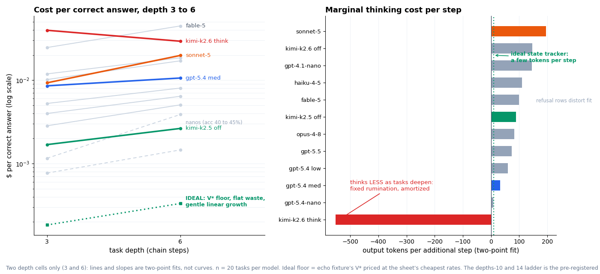

# Run 20260703T070656Z_098392: Analysis

**Date:** 2026-07-03 · **Tasks:** 20 hybrid `prog+chain+table` (10 × depth 3 / 1 distractor, 10 × depth 6 / 3 distractors) · **Workers:** 1 · **Output cap:** 16,384 · **Prices:** `pricing/prices.json` `2026-07-02.roster-v1`

Twelve model configurations plus the `echo_model` reference, 260 result rows total. Batch 1 (three validated configs) ran after per-config probes; batch 2 (the remaining nine) ran without pre-flight probes and is audited post hoc below. Roster and exact per-row API parameters: `manifest.json`. Batch-1 probes: `VALIDATION.md`.

## Final tables (`teb compare`)

```
== Leaderboard (sorted by $/correct) ==
model                                 n    acc   $/correct  waste x    eff  out_tok
------------------------------------------------------------------------------------
openai:gpt-4.1-nano                  20  0.450     0.00108     11.2  0.087     1109
openai:gpt-5.4-nano                  20  0.400     0.00184      5.4  0.158      520
moonshot:kimi-k2.5#thinking=off      20  1.000     0.00217      6.1  0.144      637
moonshot:kimi-k2.6#thinking=off      20  0.900     0.00395      7.3  0.127      787
anthropic:claude-haiku-4-5           20  0.800     0.00520      7.0  0.126      734
openai:gpt-5.4#effort=low            20  0.950     0.00673      3.3  0.247      355
openai:gpt-5.4#effort=medium         20  1.000     0.00958      5.6  0.168      568
anthropic:claude-opus-4-8            20  0.950     0.01380      4.1  0.201      402
anthropic:claude-sonnet-5            20  0.900     0.01396     11.1  0.085     1134
openai:gpt-5.5                       20  0.950     0.01539      3.8  0.219      416
moonshot:kimi-k2.6                   20  0.950     0.03418     77.8  0.018     8015
anthropic:claude-fable-5             20  0.750     0.03530      5.0  0.172      407
echo_model                           20  1.000    unpriced      0.0  1.000        2

== accuracy by difficulty ==
model                              hybrid_prog+chain+table_d3  hybrid_prog+chain+table_d6
anthropic:claude-fable-5                                0.700                       0.800
anthropic:claude-haiku-4-5                              0.800                       0.800
anthropic:claude-opus-4-8                               0.900                       1.000
anthropic:claude-sonnet-5                               1.000                       0.800
echo_model                                              1.000                       1.000
moonshot:kimi-k2.5#thinking=off                         1.000                       1.000
moonshot:kimi-k2.6                                      0.900                       1.000
moonshot:kimi-k2.6#thinking=off                         0.900                       0.900
openai:gpt-4.1-nano                                     0.500                       0.400
openai:gpt-5.4#effort=low                               0.900                       1.000
openai:gpt-5.4#effort=medium                            1.000                       1.000
openai:gpt-5.4-nano                                     0.600                       0.200
openai:gpt-5.5                                          0.900                       1.000

== $/correct by difficulty ==
model                              hybrid_prog+chain+table_d3  hybrid_prog+chain+table_d6
anthropic:claude-fable-5                              0.02461                     0.04465
anthropic:claude-haiku-4-5                            0.00399                     0.00641
anthropic:claude-opus-4-8                             0.01018                     0.01705
anthropic:claude-sonnet-5                             0.00929                     0.01979
moonshot:kimi-k2.5#thinking=off                       0.00169                     0.00264
moonshot:kimi-k2.6                                    0.03961                     0.02928
moonshot:kimi-k2.6#thinking=off                       0.00284                     0.00506
openai:gpt-4.1-nano                                   0.00077                     0.00146
openai:gpt-5.4#effort=low                             0.00526                     0.00804
openai:gpt-5.4#effort=medium                          0.00855                     0.01061
openai:gpt-5.4-nano                                   0.00116                     0.00388
openai:gpt-5.5                                        0.01189                     0.01854

== Cost decomposition: out_tok = base + rate x depth ==
model                              base out_tok  per-step     n
----------------------------------------------------------------
anthropic:claude-fable-5                    -43      99.9    20
anthropic:claude-haiku-4-5                  242     109.5    20
anthropic:claude-opus-4-8                    33      81.9    20
anthropic:claude-sonnet-5                   257     194.8    20
echo_model                                    2       0.0    20
moonshot:kimi-k2.5#thinking=off             239      88.5    20
moonshot:kimi-k2.6                        10495    -551.2    20
moonshot:kimi-k2.6#thinking=off             125     147.0    20
openai:gpt-4.1-nano                         458     144.8    20
openai:gpt-5.4#effort=low                    86      59.7    20
openai:gpt-5.4#effort=medium                423      32.1    20
openai:gpt-5.4-nano                         482       8.4    20
openai:gpt-5.5                               86      73.5    20
```

## Depth scaling



How this should scale in the ideal case, derived from the benchmark's construction: accuracy flat at 100%, output growing by only a few tokens per additional step (one small state update each), so cost per correct answer grows gently and linearly, driven mostly by the longer prompt, and the waste ratio stays constant across depth. The dotted floor in the left panel is that ideal, priced from the echo fixture's actual V* at the sheet's cheapest rates: \$0.00018 at depth 3, \$0.00033 at depth 6.

Against that reference, the observed signatures separate into three:

- **No configuration matches the ideal.** The cheapest clean sheet sits 8x above the floor and steepens toward depth 6.
- **The overthinker's tell is falling waste.** `kimi-k2.6` (default) is the only line that goes down, and not from skill: a five-figure fixed rumination tax amortizes over bigger problems (the K2.5 smoke run showed the same pattern, 38x waste at depth 3 falling to 17x at depth 14). Falling waste with depth looks like maturity and is the opposite.
- **The underthinker's tell is collapse.** `gpt-5.4-nano` holds the flattest per-step slope on the board (8.4 tokens) while its accuracy halves from 60% to 20%: cheap steps into wrong answers.

Two depth cells make these two-point fits, not curves; the depths-10 and 14 ladder is the pre-registered test.

## Verification (independent of the harness)

- **Row inventory**: 260 rows = 13 configs × 20 tasks. Exactly one truncation in the entire run: `moonshot:kimi-k2.6` (default thinking) hit the 16,384 cap on task `..2c6004c33dde` (`finish_reason: length`, no answer). Every other row finished `stop` / `end_turn` / `refusal`.
- **Dollars recomputed from raw rows × price sheet**: all twelve priced configs match the leaderboard to the fifth decimal (spot values: kimi-2.5-off \$0.00217, gpt-5.4-medium \$0.00958, fable-5 \$0.03530, gpt-4.1-nano \$0.00108).
- **Knob evidence**: both `#thinking=off` configs carry empty `reasoning_content` in all 20 rows; `#effort=low` carries mean 344 reasoning tokens vs medium's 555; the nanos report zero reasoning tokens throughout.
- **Task integrity spot check**: the most-missed task (`..2c6004c33dde`, missed by 8 of 12) was re-derived by hand: script prints 981; chain 981 × 7 = 6,867, × 4 = 27,468, ÷ 4 = 6,867; totals East 7,130, South 219, North 287; answer 7,130 − 219 = 6,911, matching the stored canonical. The task is well formed; the misses are real.

## Miss autopsies

**Sonnet 5 (2/20, both depth 6).** Clean `end_turn` completions, distractors correctly identified, arithmetic slip mid-chain (answered 1066 vs 1079, and 1020 vs 929). Genuine accuracy failures, billed in full.

**Fable 5 (5/20, all `stop_reason: refusal`).** The Anthropic API returned a refusal stop reason on five tasks whose prompts contain nothing but warehouse arithmetic: three returned entirely empty text (3 output tokens each), two cut off mid-solution (266 and 339 tokens, one visibly working through the script before stopping). Tasks: `..2c6004c33dde`, `..3e9ffeb7be88`, `..b2b048d5a383`, `..2b2abf88b6d5`, `..15d2686d73da`. We make no claim about why; we report the measured behavior: the most expensive model on the sheet (\$10/\$50 per Mtok) declined 25% of middle-school arithmetic tasks, every one replayable from `tasks.jsonl`. Its negative decomposition intercept (base −43) is an artifact of these 3-token refusal rows.

**The shared trap (`..2c6004c33dde`, depth 3, missed by 8 of 12).** The prompt contains one distractor sentence: "A returned pallet of 63 parcels sat unprocessed at the East depot all week." Opus 4.8 and GPT-5.4-low both answered 6,974 = 6,911 + 63 (identical absorption of the distractor into East's total); Haiku answered 6,848 = 6,911 − 63 (subtracted it instead); K2.6-default thought itself to death on it; Fable refused it; the nanos and GPT-5.5 missed it in unrelated ways. Four configs plus echo solved it exactly. One irrelevant sentence, eight failures, three distinct failure mechanisms.

**The nanos (45% and 40%).** Misses are spread across both depths and look like ordinary capability limits, with gpt-5.4-nano collapsing at depth 6 (20%). Their table-topping \$/correct is real but conditional: it prices retry economics, which requires an oracle to detect wrongness. Without one, a 40% model is not cheap; it is unusable.

## Reading

The thinking knob is a dial with wildly different exchange rates per vendor. GPT-5.4 low → medium buys the last 5 accuracy points for 1.4x the money (\$0.0067 → \$0.0096). Kimi K2.6 off → on buys the same 5 points for 8.7x (\$0.0040 → \$0.0342), at 77.8x waste and 8,015 mean output tokens, and its negative per-step slope (base 10,495, rate −551) repeats the smoke-run finding: the overthinking is worst on the easiest tasks. `gpt-5.4#effort=low` is the run's quiet star (95%, waste 3.3x, efficiency 24.7%, 355 mean tokens); `kimi-k2.5#thinking=off` remains the only budget-priced clean sheet (100% at \$0.0022). The premium tier does not convert price into outcomes on these tasks: GPT-5.5 and Opus 4.8 sit at 95% for six to seven times Kimi-instant's \$/correct, and Fable 5 combines the highest unit price with a 25% refusal rate.

Selection caveat, updated: batch 1 (the original three rows) was shortlisted after a validation probe; batch 2 is the full priced roster run without shortlisting, so the board as a whole is now closer to a census. Batch 2 had no pre-flight probes; this document is its post-hoc audit.

## Extended commentary (detail behind the README bullets)

**The spread.** Twelve configurations, identical questions, and a 33x spread in the cost of a correct answer. The nanos top \$/correct at 40 to 45% accuracy, which is the metric working as designed: it prices retry economics, and dirt-cheap wrong answers barely dent it when wrongness is detectable and a re-query is free. Where correctness must hold without an oracle, the cheapest clean sheet is kimi-k2.5 instant at \$0.0022, and the quiet star is gpt-5.4 at low effort: 95% accuracy with the board's best waste (3.3x) and efficiency (24.7%), at half of Sonnet's cost per correct.

**Recency and price predict \$/correct inversely here.** The five most recently released premium models (Opus 4.8, Sonnet 5, GPT-5.5, Kimi K2.6, Fable 5) occupy the five worst \$/correct ranks. Two mechanisms drive it: higher unit prices that their accuracy does not offset (GPT-5.5 and Opus deliver 95% at six to seven times Kimi-instant's cost per correct), and failure modes unique to the newest tier (K2.6's 8,015-token rumination, Fable's refusals). On these tasks, sticker prestige bought nothing per dollar.

**Claims versus checkable work.** Every task here is verifiable with middle-school math and the ability to trace a short loop. This generation of models arrived with gold-medal IMO results (OpenAI, Google DeepMind), gold-level IOI scores, and beyond-PhD accuracy on GPQA. Yet on this board, one distractor sentence about a returned pallet of 63 parcels took down eight of twelve configurations, and the most expensive model refused a quarter of the tasks. That is the measurable version of what buyers have started saying out loud; Palantir's Alex Karp told CNBC these models "have been completely, irresponsibly, oversold," with enterprises paying for tokens that create no value. The gap between benchmark prestige and per-dollar reliability on checkable work is exactly what this benchmark measures.
