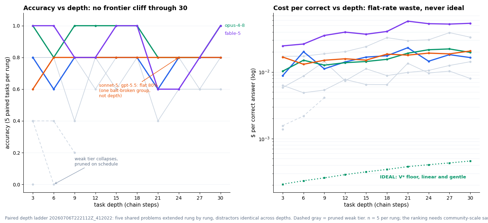

# Paired ladder run 20260706T222112Z_412022-paired: Analysis

**Date:** 2026-07-06 · **Design:** paired depth ladder (five groups, each ONE underlying problem extended across rungs 3, 6, ..., 30; program, table, and distractor sentences identical within a group; chain ops prefixed) · **Distractors:** 2 · **Pruning:** pre-registered in `scripts/run_depth_ladder.py` (accuracy <= 20% at a rung, or mean efficiency < 5%) · **Moonshot:** skipped this run for US serving latency.

## Business view

```
== Business view: risk-adjusted $/correct (beta=0.8, k per 20 tasks, eff gate 5%) ==
 # model                                  n   acc wrong     eff  $/correct risk-adj $/corr  verdict
----------------------------------------------------------------------------------------------------
 1 anthropic:claude-opus-4-8             50   92%     4  21.87%    0.01617         0.02862  
 2 anthropic:claude-fable-5              50   86%     7  17.43%    0.04085         0.23494  
 3 openai:gpt-5.5                        50   80%    10  22.14%    0.02628         0.93348  
 4 anthropic:claude-sonnet-5             50   78%    11  10.60%    0.01710         1.28563  
 5 openai:gpt-5.4#effort=medium          50   76%    12  18.29%    0.01580         2.70122  
 6 anthropic:claude-haiku-4-5            50   74%    13  13.09%    0.00686         2.86164  
 7 openai:gpt-5.4#effort=low             50   70%    15  28.33%    0.00993           30.59  
 8 openai:gpt-5.4-nano                   15   33%    10  14.60%    0.00232         3.9e+14  
 9 openai:gpt-4.1-nano                   10   20%     8   7.31%    0.00409         2.6e+22  
 - deepseek:deepseek-v4-pro              50   76%    12   4.97%    0.00391         0.66829  gated: efficiency 4.97% below 5% floor (too slow/wasteful to wait for)
 - moonshot:kimi-k2.5                    50   76%    12   1.46%    0.04021         6.87264  gated: efficiency 1.46% below 5% floor (too slow/wasteful to wait for)
 - moonshot:kimi-k2.6                    50   72%    14   1.83%    0.05359           58.64  gated: efficiency 1.83% below 5% floor (too slow/wasteful to wait for)
 - openai:gpt-5.4                         5    0%     5   0.00%        n/a             n/a  no correct answers in 5
```

## Findings



- **No depth cliff through depth 30 for the frontier tier.** Sonnet 5 solved every non-trap group at every rung including 30; GPT-5.5 the same; Opus wobbled between 4/5 and 5/5; Fable dipped at 21 and 24 and closed 5/5 at 30. Efficiency stayed flat with depth for everyone (fixed overhead amortizing), never approaching the ideal floor.
- **The 77-parcel exhibit.** One group's two distractor sentences (returned pallets of 213 and 136 parcels) produced the same wrong answer, exactly canonical minus 77, at every rung from depth 3 to 18, from Sonnet, Haiku, GPT-5.4 low and medium, GPT-5.5, and 5.4-nano. Deterministic bait absorption, reproduced across labs and depths; only Opus and Fable filtered it consistently. Paired mode is what makes this attributable: the bait is byte-identical at every depth.
- **Failure taxonomy.** Persistent trait failures (the trap group, depth-independent), transient slips (missing a group at depth 9 and solving the same extended problem at 12), and weak-tier collapse (gpt-5.4 default 0/5 at rung 3; 4.1-nano dead at 6; 5.4-nano at 9). No frontier config exited via the depth door up to 30.
- **Honest update to the pre-registered prediction.** The strong form (plan-selectors break by depth 10 to 14) is wrong for this tier on these chains; what holds is the cost form: accuracy survives, waste stays flat-rate and far above ideal, and error behavior is dominated by persistent traps rather than depth.

Caveats: five groups per rung; one bait-broken group pins most models at 80% forever, so the effective depth-sensitivity sample is four groups. More groups is the follow-up; task set and every response are in this directory for replay.


## How to read this board (method notes)

- **acc** is accuracy on the 50 tasks each surviving config saw; **eff** is mean token efficiency; **$/correct** is raw dollars per correct answer.
- **risk-adj $/correct** is the buying number: raw $/correct divided by 0.8^(k^2), k = wrong answers per 20 tasks. One wrong keeps 80% of value, two 41%, three 13%, four 3%. There is no hard unusability cutoff; the exponential penalty lets hopeless configs price themselves into the billions per trusted answer.
- **cost / 1M workflows / mo** = risk-adj $/correct x 1,000,000, the monthly bill to run a million of these workflows with wrong-answer cleanup priced in.
- **Efficiency gate** (a constraint, not a weight): a config below 5% mean efficiency is flagged as too slow or wasteful to wait for and drops below the ranked rows (DeepSeek at 4.97% just under; Kimi's default thinking modes far under).
- **Why n varies**: weak configs are pruned mid-ladder by the pre-registered rules in `scripts/run_depth_ladder.py`, so they saw fewer tasks (gpt-5.4-nano 15, gpt-4.1-nano 10, gpt-5.4 default 5).
- **Moonshot #thinking=off** variants that top the everyday board sat out this run for US serving latency; the two default-thinking Moonshot rows that did run are gated for efficiency.
- **Reproduce**: `teb compare --results benchmark_data/runs/20260706T222112Z_412022-paired/results.jsonl --pricing pricing/prices.json --business`. The ranking needs statistically stronger samples than five groups; scaling it is a community-sized job the harness makes cheap.
